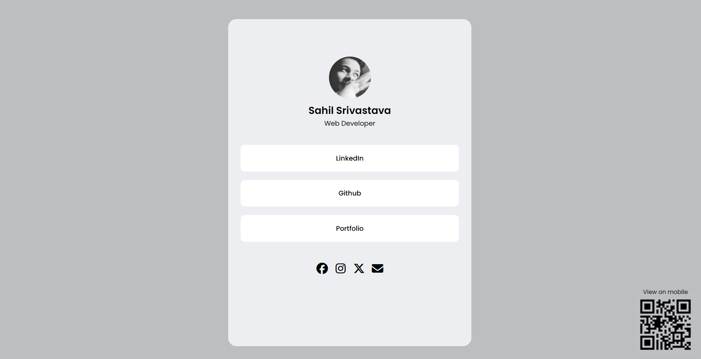

# 🌐 Contact Info Card (Linktree Inspired)

This is a simple **personal contact card website** inspired by Linktree.  
It’s built with **vanilla HTML & CSS**, no frameworks or libraries.  
The page acts like a **digital visiting card** where all my contact details, links, and social profiles are in one place.

---

## ✨ Features
- 📸 **Profile Image** at the top  
- 📝 **Details Box** with name & short info  
- 🔗 **Quick Links Section** for important links (portfolio, resume, projects, etc.)  
- 🌍 **Social Media Icons** with Font Awesome  
- 📱 **QR Code** for quick sharing  
- 🎨 **Clean UI** with responsive design (works on mobile & desktop)  

---

## 🛠️ Tech Stack
- **HTML5** for structure  
- **CSS3** for styling & layout  
- **Font Awesome** for icons  

---

## 📷 Preview


---

## 🚀 Getting Started
1. Clone the repo:
   ```bash
   git clone https://github.com/your-username/contact-card.git
